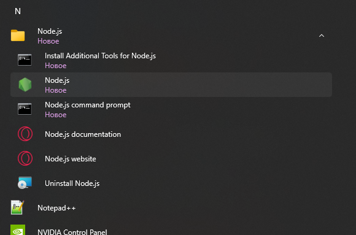
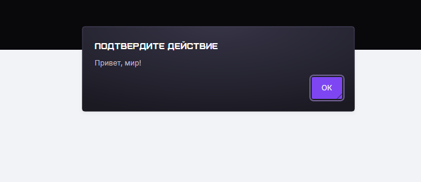
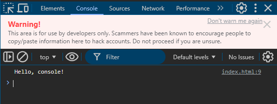
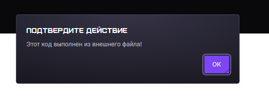
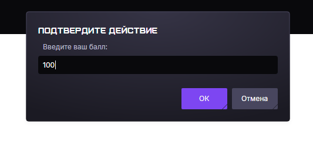
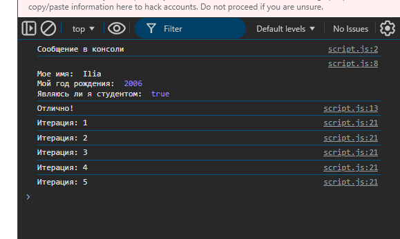

# Лабараторная №1 `Caralasciuc Ilia IA2403`
## Запуск проекта
- Открытие файла `index.html`
- Открытия консоли браузера, чреез `F12` или `конекстное меню->код элемента`

## Цель лабораторной работы
Изучить основы JS, написать и выполнить код в браузере

## Оглавление
- Выполнение заданий

  1. [Задание 1](#задание-1)
  2. [Задание 2](#задание-2)
- [Контрольные вопросы](#контрольные-вопросы)
- [Список источников](#использованные-источники)

## Задание 1

1. Подготовка среды:
- Установил текстовый редактор VS Code.
- Установил Node.js
  


2. Выполнение кода JavaScript в браузере

   - Открыл консоль разработчика (`F12` → `Console`).
   - Написал команду `console.log("Hello, world!");` и нажал Enter.
   - Записал в консоли `2 + 3` и посмотрел результат.

    

3. Выполнение кода JavaScript в браузере
    - Создал файл `index.html` и вставил в него следующий код.

   ```html
   <!DOCTYPE html>
   <html lang="en">
     <head>
       <title>Привет, мир!</title>
     </head>
     <body>
       <script>
         alert("Привет, мир!");
         console.log("Hello, console!");
       </script>
     </body>
   </html>
   ```

   - Открыл `index.html` в браузере и посмотрел, как выполняется код.

  
  

4. Подключение внешнего JavaScript-файла
    - Создал файл script.js и добавил в него     код:

       ```javascript
       alert("Этот код выполнен из внешнего     файла!");
       console.log("Сообщение в консоли");
       ```

    - Подключил файл в `index.html`,    добавил в `<head>`

       ```html
       <script src="script.js"></script>
       ```

    - Открыл страницу в браузере.
      
       
       


## Задание 2
1. Объявление переменных и работа с типами данных.

   - В файле `script.js` создайте несколько переменных:

     - `name` - строка с вашим именем.
     - `birthYear` - число, представляющее год вашего рождения.
     - `isStudent` - логическая переменная, указывающая, являетесь ли вы студентом.

   - Выведите их в консоль.

2. Управление потоком выполнения (условия и циклы)

   - Добавьте следующий код в `script.js`:

   ```javascript
   let score = prompt("Введите ваш балл:");
   if (score >= 90) {
     console.log("Отлично!");
   } else if (score >= 70) {
     console.log("Хорошо");
   } else {
     console.log("Можно лучше!");
   }

   for (let i = 1; i <= 5; i++) {
     console.log(`Итерация: ${i}`);
   }
   ```

   - Откройте страницу в браузере и посмотрите, как работают условия и циклы.

    
    

## Контрольные вопросы
1. Переменные
 - `var` - это старый вариант обьявления переменной, которая имеет в области видимости всю программу.
 - `let` - ключевое слово бля обьявления изменяемых переменных
 - `const` - ключевое слово для обьявления неизменяемых переменных

 2. `Неявное преобразование`  - это автоматическое преобразование типа значения или переменной, например при использовании арифметических операций `*, +, -` между разными по типу значениями `let result = "10" - 5;`

 3. `==` - это проверка совпадения значений, без проверки типа переменной, в то время как `===` проверяет сначала совпадение по значению, а потом еще и по типу данных
    ```javascript
     console.log(5 == "5");   // true — неявное преобразование строки в число
     console.log(5 === "5");  // false — строгое сравнение без преобразования
    ```

## Использованные источники
- [MoodleUSM](https://moodle.usm.md/mod/page/view.php?id=300750)
- [Stack Overflow](https://ru.stackoverflow.com/questions/789389/Как-в-markdown-сделать-ссылку-для-перехода-к-заголовку)
- [GitHub](https://gist.github.com/asabaylus/3071099#start-of-content)
