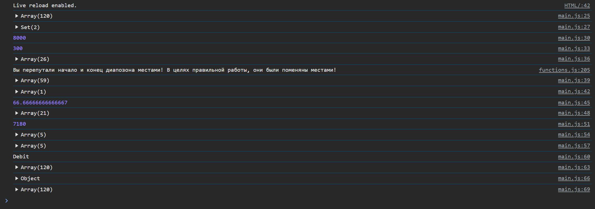
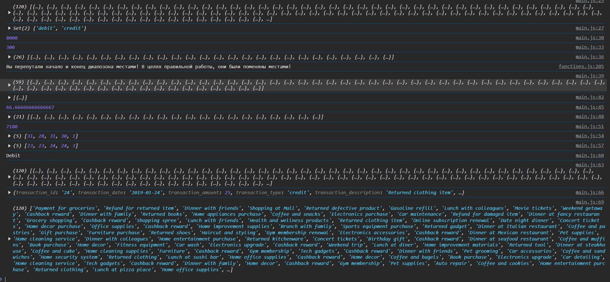

# Лабораторная №2 `Caralasciuc Ilia IA2403`
## Запуск проекта
- Открытие файла `HTML\index.html`
- Открытия консоли браузера, чреез `F12` или `конекстное меню->код элемента`

## Цель лабораторной работы
Изучить основы работы с массивами и функциями в JavaScript, применяя их для обработки и анализа транзакций.

## Оглавление
- Выполнение заданий

  1. [Шаг 1](#шаг-1)
  2. [Шаг 2](#шаг-2)
  3. [Шаг 3](#шаг-3)
- [Контрольные вопросы](#контрольные-вопросы)
- [Список источников](#использованные-источники)

## Шаг 1. Создание массива транзакций

  - Создал файл main.js для размещения вашего кода.
  - Взял массив объектов с транзакциями. Каждая транзакция содержит следующие свойства:

    - transaction_id - уникальный идентификатор транзакции.
    - transaction_date - дата транзакции.
    - transaction_amount - сумма транзакции.
    - transaction_type - тип транзакции (приход или расход).
    - transaction_description - описание транзакции.
    - merchant_name - название магазина или сервиса.
    - card_type - тип карты (кредитная или дебетовая).

## Шаг 2. Реализация функций для анализа транзакций


### 1. `getUniqueTransactionTypes(transactions)`

  - Возвращает массив уникальных типов транзакций.
  - Используйте Set() для выполнения задания.

  ```javascript
    /**
     * Получает массив транзакций и возвращает массив с используемыми там типами транзакций
     * @param {Array} transactions  Массив транзакций
     * @returns {Array} Массив уникальных типов транзакций
     */
    export function getUniqueTransactionTypes(transactions)
    {
        let SetTransactions = new Set();
        for(let i = 0; i < transactions.length; i++)
        {
            SetTransactions.add(transactions[i].transaction_type);
        }
        return SetTransactions;
    }
  ```

### 2. `calculateTotalAmount(transactions)`  – Вычисляет сумму всех транзакций.

```JS
  /**
   * Высчитает сумму для поля transaction_amount всех элементов массива
   * @param {*} transactions Массив транзакций
   * @returns {Number} Числовое значение суммы
   */
  export function calculateTotalAmount(transactions)
  {
      /*
      let SumAmount = 0;
      for(let i = 0; i < transactions.length; i++)
          {
              SumAmount += transactions[i].transaction_amount;
          }
      return SumAmount;
      */

      return transactions.reduce((sum, item) => sum + item.transaction_amount, 0);
  }
```

### 3. calculateTotalAmountByDate(transactions, year, month, day) [extra]

- Вычисляет общую сумму транзакций за указанный год, месяц и день.
- Параметры year, month и day являются необязательными.
- В случае отсутствия одного из параметров, метод производит расчет по остальным.

```JS
/**
 * Вычисляет общую сумму транзакций за указанный год, и/или месяц и/или день
 * @param {Array} transactions Массив транзакций
 * @param {string | number} year Необязательный параметр, год транзакции
 * @param {string | number} month Необязательный параметр, месяц транзакции
 * @param {string | number} day Необязательный параметр, день транзакции
 * @returns {number} Числовое значение суммы за указанную дату
 */
export function calculateTotalAmountByDate(transactions, year, month, day)
{
    let SumAmountByDate = 0;
    let isYear = true, isMonth = true, isDay = true;
    if(year === undefined)
        isYear = false;
    if(month === undefined)
        isMonth = false;
    if(day === undefined) 
        isDay = false;

    if(isYear && isMonth && isDay)
    {
        for(let i = 0; i < transactions.length; i++)
            {
                let dates = transactions[i].transaction_date.split("-");
                if(dates[0] == year && dates[1] == month && dates[2] == day)
                {
                    SumAmountByDate += transactions[i].transaction_amount;
                }
            }
        
        return SumAmountByDate;
    }

    if(isYear && isMonth)
    {
        for(let i = 0; i < transactions.length; i++)
            {
                let dates = transactions[i].transaction_date.split("-");
                if(dates[0] == year && dates[1] == month)
                {
                    SumAmountByDate += transactions[i].transaction_amount;
                }
            }   
    
        return SumAmountByDate;     
    }
    
    if(isYear && isDay)
    {
        for(let i = 0; i < transactions.length; i++)
            {
                let dates = transactions[i].transaction_date.split("-");
                if(dates[0] == year && dates[2] == day)
                {
                    SumAmountByDate += transactions[i].transaction_amount;
                }
            }       

        return SumAmountByDate; 
    }

    if(isDay && isMonth)
    {
        for(let i = 0; i < transactions.length; i++)
            {
                let dates = transactions[i].transaction_date.split("-");
                if(dates[1] == month && dates[2] == day)
                {
                    SumAmountByDate += transactions[i].transaction_amount;
                }
            }       
            
        return SumAmountByDate;
    }

    if(isYear)
    {
        for(let i = 0; i < transactions.length; i++)
            {
                let dates = transactions[i].transaction_date.split("-");
                if(dates[0] == year)
                {
                    SumAmountByDate += transactions[i].transaction_amount;
                }
            }        
    
        return SumAmountByDate;
    }

    if(isMonth)
    {
        for(let i = 0; i < transactions.length; i++)
            {
                let dates = transactions[i].transaction_date.split("-");
                if(dates[1] == month)
                {
                    SumAmountByDate += transactions[i].transaction_amount;
                }
            }    

        return SumAmountByDate; 
    }

    if(isDay)
    {
        for(let i = 0; i < transactions.length; i++)
            {
                let dates = transactions[i].transaction_date.split("-");
                if(dates[2] == day)
                {
                    SumAmountByDate += transactions[i].transaction_amount;
                }
            }        

        return SumAmountByDate;
    }

    return SumAmountByDate;
}
```

### 4. `getTransactionByType(transactions, type)` - Возвращает транзакции указанного типа (debit или credit)

```JS
/**
 * Проходит изначальный массив транзакций и создает новый, где будут только транзакции с указанным типом
 * @param {Array} transactions Массив транзакций
 * @param {string} type Тип транзакции
 * @returns {Array} Массив транзакций указанного типа
 */
export function getTransactionByType(transactions, type)
{
    /*
    let thisTypeTransactions = [];
    for(let i = 0; i < transactions.length; i++)
        {
            if(transactions[i].transaction_type == type)
            {
                thisTypeTransactions.push(transactions[i]);
            }
        }
    return thisTypeTransactions;
    */
    return transactions.filter(transaction => transaction.transaction_type == type);
}
```

### 5. `getTransactionsInDateRange(transactions, startDate, endDate)` – Возвращает массив транзакций, проведенных в указанном диапазоне дат от startDate до endDate.

```JS
/**
 * Возвращает массив транзакций, произведенных в диапозоне между начальной и конечной датой
 * @param {Array} transactions Массив транзакций
 * @param {string} startDate Дата - начало диапозона
 * @param {string} endDate  Дата - конец диапозона
 * @returns {Array} Массив транзакций в диапозоне дат
 */
export function getTransactionsInDateRange(transactions, startDate, endDate)
{
    let startDateSplit = startDate.split("-");
    let endDateSplit = endDate.split("-");
    let flag = (startDateSplit[0] > endDateSplit[0]) 
    ? true 
    : (startDateSplit[0] == endDateSplit[0] 
        ? (startDateSplit[1] > endDateSplit[1] 
            ? true 
            : (startDateSplit[1] == endDateSplit[1] 
                ? (startDateSplit[2] > endDateSplit[2] 
                    ? true 
                    : false)
                : false)) 
        : false );


    if(flag)
    {
        console.log("Вы перепутали начало и конец диапозона местами! В целях правильной работы, они были поменяны местами!");
        let buffer = startDateSplit;
        startDateSplit = endDateSplit;
        endDateSplit = buffer;
    }

    let arrayOfTransactions = [];
    for(let i = 0; i < transactions.length; i++)
        {
            let DateSplit = transactions[i].transaction_date.split("-");

            if(startDateSplit[0] < DateSplit[0] && DateSplit[0] < endDateSplit[0])
            {
                arrayOfTransactions.push(transactions[i]);
                continue;
            }
            if(startDateSplit[1] < DateSplit[1] && DateSplit[1] < endDateSplit[1])
            {
                arrayOfTransactions.push(transactions[i]);
                continue;
            }
            if(startDateSplit[1] == DateSplit[1] && startDateSplit[2] <= DateSplit[2])
            {
                arrayOfTransactions.push(transactions[i]);
                continue;
            }
            if(endDateSplit[1] == DateSplit[1] && endDateSplit[2] >= DateSplit[2])
            {
                arrayOfTransactions.push(transactions[i]);
                continue;
            }
        }
    return arrayOfTransactions;
}

```

### 6. `getTransactionsByMerchant(transactions, merchantName)` – Возвращает массив транзакций, совершенных с указанным merchantName.

```js
/**
 * Проходит изначальный массив транзакций и создает новый, где будут только транзакции с заданным продавцом
 * @param {Array} transactions Массив транзакций
 * @param {string} merchantName Имя продавца
 * @returns {Array} Массив транзакций с заданным продавцом
 */
export function getTransactionsByMerchant(transactions, merchantName)
{
    let arrayOfTransactions = [];

    for(let i = 0; i < transactions.length; i++)
        {
            if(transactions[i].merchant_name == merchantName)
            {
                arrayOfTransactions.push(transactions[i]);
            }
        }

    return arrayOfTransactions;
}
```

### 7. `calculateAverageTransactionAmount(transactions)` – Возвращает среднее значение транзакций.

```js
/**
 * Высчитывает среднее значение транзакции между всеми транзакциями
 * @param {Array} transactions Массив транзакций
 * @returns {Array} среднее арифметическое поля transaction_amount
 */
export function calculateAverageTransactionAmount(transactions)
{
    let sumAmount = calculateTotalAmount(transactions);
    return sumAmount / transactions.length;
}
```

### 8. `getTransactionsByAmountRange(transactions, minAmount, maxAmount)` – Возвращает массив транзакций с суммой в заданном диапазоне от minAmount до maxAmount.

```js
/**
 * Вовзращает массив транзакций, поле transaction_amount которых находится в диапозоне между minAmount и maxAmount
 * @param {Array} transactions Массив транзакций
 * @param {string | number} minAmount Минимальная сумма транзакции
 * @param {string | number} maxAmount Максимальная сумма транзакции
 * @returns {Array} Массив транзакций 
 */
export function getTransactionsByAmountRange(transactions, minAmount, maxAmount)
{
    let arrayOfTransactions = [];

    if(minAmount > maxAmount)
    {
        let buffer = minAmount;
        minAmount = maxAmount;
        maxAmount = buffer;
    }

    for(let i = 0; i < transactions.length; i++)
        {
            if(transactions[i].transaction_amount <= maxAmount && transactions[i].transaction_amount >= minAmount)
            {
                arrayOfTransactions.push(transactions[i]);
            }
        }

    return arrayOfTransactions;
}
```

### 9. `calculateTotalDebitAmount(transactions)` – Вычисляет общую сумму дебетовых транзакций.

```js
/**
 * Вычисляет сумму для всех дебитовых транзакций
 * @param {Array} transactions Массив транзакций
 * @returns {number} Сумма дебитовых транзакций
 */
export function calculateTotalDebitAmount(transactions)
{
    let arrayOfTransactions = getTransactionByType(transactions, "debit");
    return calculateTotalAmount(arrayOfTransactions);
}
```

### 10. `findMostTransactionsMonth(transactions)` – Возвращает месяц, в котором было больше всего транзакций.

```js
/**
 * Возвращает месяц, в котором было больше всего транзакций
 * @param {Array} transactions Массив транзакций
 * @returns {Array} Массив, в котором последний элемент - индекс лучшего месяца, а остальные элементы - количество транзакций в каждом месяце
 */
export function findMostTransactionsMonth(transactions)
{
    let firstDate = transactions[0].transaction_date;
    let lastDate = transactions[transactions.length -1].transaction_date;

    let diff = Number(lastDate.split("-")[1]) - Number(firstDate.split("-")[1]);
    
    let arrayOfColTransactions = [];

    for(let i = 1; i <= diff + 1; i++)
    {
        arrayOfColTransactions.push(0);
        for(let j = 0; j < transactions.length; j++)
        {
            if(i == transactions[j].transaction_date.split("-")[1])
            {
                arrayOfColTransactions[i-1] += 1;
            }
        }
    }

    let max = arrayOfColTransactions[0];
    let maxIndex = 0;
    for( let i = 1; i < arrayOfColTransactions.length; i++)
    {
        if(max < arrayOfColTransactions[i])
        {
            max = arrayOfColTransactions[i];
            maxIndex = i;
        }
    }
    arrayOfColTransactions.push(maxIndex + 1);
    return arrayOfColTransactions;
}
```

### 11. `findMostDebitTransactionMonth(transactions)` – Возвращает месяц, в котором было больше дебетовых транзакций.

```js
/**
 * Возвращает месяц, в котором было больше дебетовых транзакций
 * @param {Array} transactions Массив транзакций
 * @returns {Array} Массив, в котором последний элемент - индекс лучшего месяца, а остальные элементы - количество транзакций в каждом месяце
 */
export function findMostDebitTransactionMonth(transactions)
{
    let arrayOfTransactions = getTransactionByType(transactions, "debit");
    return findMostTransactionsMonth(arrayOfTransactions);
}
```

### 12. `mostTransactionTypes(transactions)` -
- Возвращает каких транзакций больше всего.
- Возвращает debit, если дебетовых.
- Возвращает credit, если кредитовых.
- Возвращает equal, если количество равно.

```js
/**
 * Возвращает название типа, транзакций которого больше всего
 * @param {Array} transactions Массив транзакций
 * @returns Возвращает Debit, если больше дебитовых транзакций, Credit если кредитных и Equal если количество равное
 */
export function mostTransactionTypes(transactions)
{
    let debit = getTransactionByType(transactions, "debit");
    let credit = getTransactionByType(transactions, "credit");

    return (debit == credit) ? "Equal" : (debit > credit) ? "Debit" : "Credit";
}
```

### 13. `getTransactionsBeforeDate(transactions, date)` – Возвращает массив транзакций, совершенных до указанной даты.

```js
/**
 * Возвращает массив транзакций, совершенных до указанной даты
 * @param {Array} transactions Массив транзакций
 * @param {string} date Конечная дата транзакций
 * @returns Массив транзакций до указанный даты
 */
export function getTransactionsBeforeDate(transactions, date)
{
    return getTransactionsInDateRange(transactions, transactions[0].transaction_date, date);
}
```

### 14. `findTransactionById(transactions, id)` – Возвращает транзакцию по ее уникальному идентификатору (id).

```js
/**
 * Возвращает транзакцию по ее уникальному идентификатору (id).
 * @param {Array} transactions Массив транзакций
 * @param {number | string} id Идентификационный номер конкретной транзакции
 * @returns Обьект транзакции
 */
export function findTransactionById(transactions, id)
{
    return id > 0 && id <= transactions.length ? transactions[id-1] : "Incorrect ID!";
}
```

### 15. `mapTransactionDescriptions(transactions)` – Возвращает новый массив, содержащий только описания транзакций.

```js
/**
 * Возвращает новый массив, содержащий только описания транзакций
 * @param {Array} transactions Массив транзакций
 * @returns {Array} Массив описаний транзакций
 */
export function mapTransactionDescriptions(transactions)
{
    /*
    let arrayOfTransactions = [];

    for(let i = 0; i < transactions.length; i++)
    {
        arrayOfTransactions.push(transactions[i].transaction_description);
    }

    return arrayOfTransactions;
    */

    return transactions.map(transaction => transaction.transaction_description);
}
```


## Шаг 3. Тестирование функций

1. Создайте массив транзакций и протестируйте все функции.
2. Выведите результаты в консоль.
    

3. Проверьте работу функций на различных наборах данных.
    
4. Проверьте работу функций на пустом массиве транзакций [extra].
5. Проверьте работу функций на массиве транзакций с одной транзакцией [extra].

  ```js
  #main.js
  
  import transactions from "./transactions.js";
  
  import { 
      getUniqueTransactionTypes, 
      calculateTotalAmount, 
      calculateTotalAmountByDate, 
      getTransactionByType,
      getTransactionsInDateRange,
      getTransactionsByMerchant,
      calculateAverageTransactionAmount,
      getTransactionsByAmountRange,
      calculateTotalDebitAmount,
      findMostTransactionsMonth,
      findMostDebitTransactionMonth,
      mostTransactionTypes,
      getTransactionsBeforeDate,
      findTransactionById,
      mapTransactionDescriptions
   } from "./functions.js";
  
  
  if(transactions.length > 0)
  {
      // 1
      console.log(transactions);
      let UniqueTransactions = getUniqueTransactionTypes(transactions);
      console.log(UniqueTransactions);
  
      //2
      console.log(calculateTotalAmount(transactions));
  
      //3
      console.log(calculateTotalAmountByDate(transactions, undefined, undefined, 1));
  
      //4
      console.log(getTransactionByType(transactions, "credit"));
  
      //5
      console.log(getTransactionsInDateRange(transactions, "2019-02-31", "2019-01-01"));
  
      //6
      console.log(getTransactionsByMerchant(transactions, "SuperMart"));
  
      //7
      console.log(calculateAverageTransactionAmount(transactions));
  
      //8
      console.log(getTransactionsByAmountRange(transactions, 40, "50"));
  
      //9
      console.log(calculateTotalDebitAmount(transactions));
  
      //10
      console.log(findMostTransactionsMonth(transactions));
  
      //11
      console.log(findMostDebitTransactionMonth(transactions));
  
      //12
      console.log(mostTransactionTypes(transactions));
  
      //13
      console.log(getTransactionsBeforeDate(transactions, "2019-04-30"));
  
      //14
      console.log(findTransactionById(transactions, 24));
  
      //15
      console.log(mapTransactionDescriptions(transactions));
  }
  else
  {
      console.log("Некоторые операции нельзя провести с пустым массивом. Пожалуйста, заполните массив хоть одной   транзакцией!");
  }
  ```

## Контрольные вопросы
  1. Какие методы массивов можно использовать для обработки объектов в JavaScript?
      #### Ответ: Можно использовать такие методы, как `map()`, `filter()` и `reduce()`. Передавая в них стрелочные выражения, можно либо провести действие над всем массивом, отобрать элементы по критерию или вычислить общее значение для всех элементов.
  2. Как сравнивать даты в строковом формате в JavaScript?
      #### Ответ: Если формат даты `YYYY-MM-DD`, то можно сравнивать их напрямую через операторы сравнени `>`, `<` и `===`. Если формат другой - парсить на отдельные числа обе даты и сравнивать.
  3. В чем разница между map(), filter() и reduce() при работе с массивами объектов?
        #### Ответ: `map()` изменяет каждый элемент массива, `filter()` отбирает элементы по условию, а `reduce()` объединяет элементы в одно значение.


## Использованные источники
- [MoodleUSM](https://moodle.usm.md/mod/page/view.php?id=300750)
- [Stack Overflow](https://ru.stackoverflow.com/questions/789389/Как-в-markdown-сделать-ссылку-для-перехода-к-заголовку)
- [GitHub](https://gist.github.com/asabaylus/3071099#start-of-content)